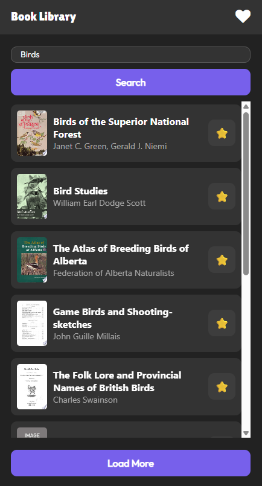
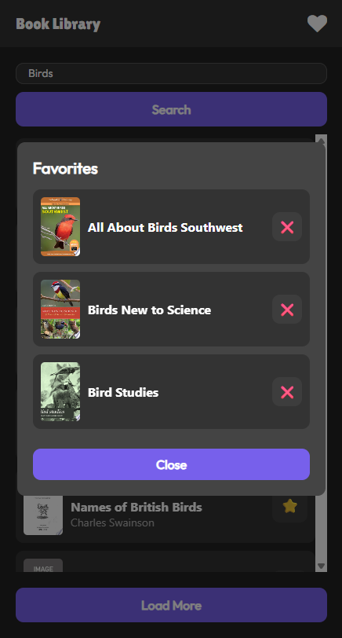
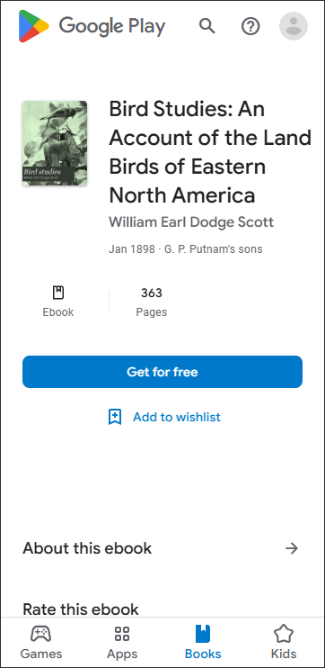

# 📚 Google Books Search App

A React Native application built with Expo that allows users to search for books using the Google Books API and save their favorites.

## 🚀 Live Demo

- [📱 Mobile Preview](https://ferrin-y.github.io/google-books-app/index.html)
- [🖥️ Full Web Version](https://ferrin-y.github.io/google-books-app/dist/app.html)


## ✨ Features

- **Book Search**: Search through millions of books using Google Books API
- **Favorites System**: Save and manage your favorite books locally
- **Responsive Design**: Works seamlessly on mobile, tablet, and web
- **Dark Theme**: Modern dark UI with smooth animations
- **Persistent Storage**: Favorites are saved using AsyncStorage
- **Load More**: Pagination support for browsing more results

## 🛠️ Technologies Used

- **React Native** - Cross-platform mobile development
- **Expo** - Development platform and tools
- **Google Books API** - Book data and search functionality
- **AsyncStorage** - Local data persistence
- **React Native Elements** - UI components
- **Google Fonts** - Custom typography (Outfit, Lilita One)

## 📱 Screenshots

<!-- Add screenshots here -->
| Search Screen | Favorites Modal | Book Details |
|---------------|-----------------|--------------|
|  |  |  |

## 🔧 Installation & Setup

### Prerequisites
- Node.js (v14 or higher)
- npm or yarn
- Expo CLI

### Local Development
```bash
# Clone the repository
git clone https://github.com/yourusername/google-books-app.git
cd google-books-app

# Install dependencies
npm install

# Start the development server
npx expo start

# For web development
npx expo start --web

# For mobile (requires Expo Go app)
# Scan the QR code with your phone
```

### Web Export
```bash
# Export for web deployment
npx expo export -p web

# Serve locally for testing
npx serve dist
```

## 📂 Project Structure

```
google-books-app/
├── components/
│   ├── BookItem.js          # Individual book display component
│   └── FavoritesModal.js    # Favorites management modal
├── assets/                  # Images and icons
├── App.js                   # Main application component
├── app.json                 # Expo configuration
├── package.json             # Dependencies and scripts
└── README.md               # Project documentation
```

## 🎨 Design Features

- **Modern Dark Theme**: Consistent dark color scheme throughout
- **Smooth Animations**: Subtle hover effects and transitions
- **Mobile-First**: Optimized for mobile devices with responsive web support
- **Intuitive UX**: Clear navigation and familiar interaction patterns
- **Custom Typography**: Beautiful Google Fonts integration

## 🔮 Future Enhancements

- [ ] User authentication and cloud sync
- [ ] Book reviews and ratings
- [ ] Reading progress tracking
- [ ] Social sharing features
- [ ] Offline mode support
- [ ] Advanced search filters

## 📄 License

This project is [MIT](https://choosealicense.com/licenses/mit/) licensed.

## 🙋‍♂️ Contact

Ferrin - [Ferrin.yesudasan@gmail.com](mailto:ferrin.yesudasan.com)

Project Link: [https://github.com/yourusername/google-books-app](https://github.com/yourusername/google-books-app)

---

⭐ Star this repo if you found it helpful!